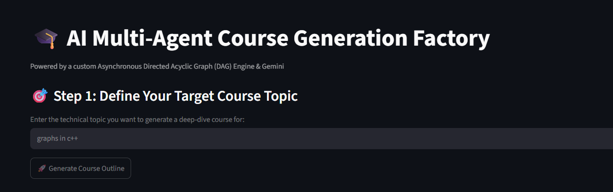
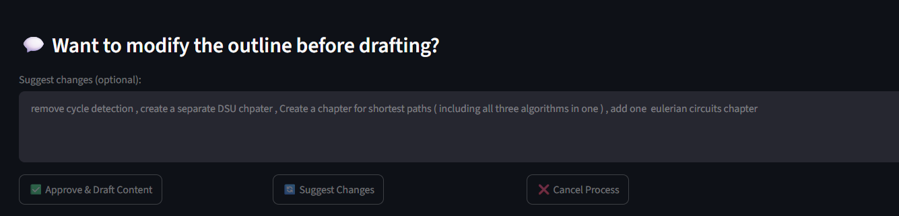
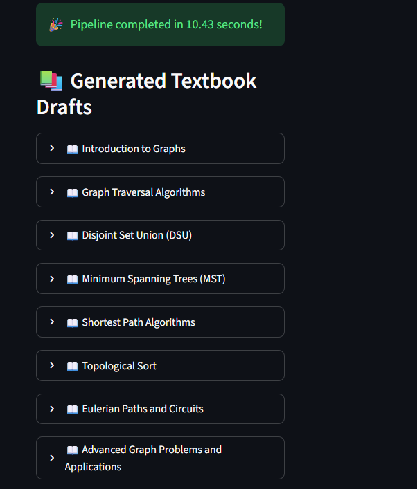

# 🎓 AI Multi-Agent Course Generation Factory

An AI-powered system that generates full technical courses using a custom async DAG engine and Google Gemini.

## Features
- Custom DAG orchestrator for parallel agent execution
- Human-in-the-Loop validation gate
- Schema-validated structured outputs via Pydantic
- Streamlit web UI

## Setup
```bash
pip install -r requirements.txt
streamlit run app.py
```

## App Screenshot



